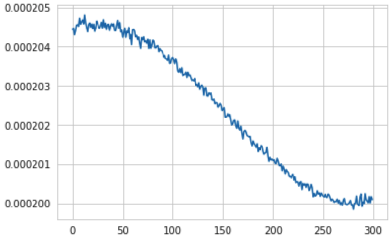
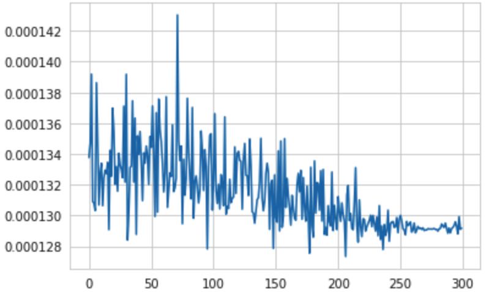

# MILTestTasks
## Add noise
To add the noise in any audio dataset you need to prepare the folder with the .flac files.
In my case the dataset with the audio was pretty large so i decided to take random sample of the audios from all dataset of the audios.

#### To add noise write in terminal:
 - python  pwd/add_noise.py \<path in\> \<subsample\>

\<path in\> - path to the directory which contains audio files (the directory can contain other directories which will lead to the audio files)
\<subsample\> - the proportion of the files which will be randomly selected from the initial dataset.
#### The output (will be created at current working directory):
 - The directory "NoisyData/" with the noisy audio files.
 - The file "audio_paths.txt" which will contain all paths to all audio files which were selected from initial dataset.

 #### The idea of the noise generation
 ##### At the task was mandatory: 
 - use short time furier transform to add noise
 - same type of noise for all audios

 So to solve both subtasks I decided to genarate three random sequences from three different distrinutions: uniform, normal, laplace. Then for each audio signal I used stft window size = 1024 and overlap = 512 and also for each audio signal I generated 3 random sequesnces from distributions with the same parameters and again used stft over that sequesnces afterward I averaged that representation of noises over axis = 1 and with some manipulation combined them together. So at the last step I had the stft representation of the audios and combined averages representation of the noises. To add the noise into the audios I have added combined averages to stft representation of the audios. At the end I have audios with different noises but all noises have the same type because they were generated from the distributions with same parameters.
 
 
 ## Audio Denoising
 I have decided to use convolutional 1d layers. So the input in my NN always should have the same shape. To solve this problem, I decided to take audios and split them with window = 1024, such window size were choosen, because I don't have much computentional power. It is obvious that each audio has different length, so I decided to take length of the audio and divide it over the window size and take intenger part of such division and then reshape the the audio with size (audio_length/1024,1024)

The archinecture which I decided to use is convolitional 1d autoencoder with kernel size = 2 and stride = 2 on each layer. 
#### Architecture:
- 1st Layer: Conv1d(in_channels=1, out_channels=8)            (Tanh)
- 2nd Layer: Conv1d(in_channels=8, out_channels=16)           (Tanh)
- 3rd Layer: Conv1d(in_channels=16, out_channels=32)          (Tanh)
- 4th Layer: ConvTranspose1d(in_channels=32, out_channels=16) (Tanh)
- 5th Layer: ConvTranspose1d(in_channels=16, out_channels=8)  (Tanh)
- 6th Layer: ConvTranspose1d(in_channels=8, out_channels=1)   (Tanh)
- 7th Layer: Linear with 1024 input and 1024 output

## Results 
I have decided to use 6000 audios (because to prepare the audios takes a lot of time) and prepare them with respect to the alghorithm which I have described above. 

First I have trained for 150 epoch batch size equal to 16 and learning rate equal to 0.001 and also I have added the scheduler which starts to change the learning rate from 26 epoch, and check the result. I have found that the noise become quiter, but also the voices of the speakers have changed. So i decided to increase the batch size and train for 300 epoch more. Afterward I got that the noise become considerably quiter and the voices of the speakers stayed the same. 

The next plot is the plot of train MSE over for each epoch with devided over the length of the train data, so average MSE with respect to the size of the train dataset

The next plot is the plot of validation MSE over for each epoch with devided over the length of the validation data, so average MSE with respect to the size of the validation dataset

#### Examples:
You can listen test examples:

- Noisy Audio: https://drive.google.com/drive/folders/1U1moePCoUtTBPxRTQ6LtnUeBJOSiHKLd?usp=sharing

- Clean Audio: https://drive.google.com/drive/folders/1WAzreF7smQuI5HMKzuR7yd8jpn8nLolo?usp=sharing

## Additional ideas
I was thinking about an additional way of removing noise from the speech audio singnal and I was thinking the it will be really usefull to have sample of noise which should be removed and I have found that it was already done. So in our case we can easily get sample of noise from the audio, but in real world it can be harder, so I have found the way to extract the noise sample from the audio. The code can be found in folder "Additional". The main idea is that during the speach each of us doing some small interuption (to take a break or find appropriate words) so I have found the moments when the person is quite
and extracted the noise, then I have deleted the noise with help of the library "noisereduce" which is using algorithm based on FFT.

#### Examples:
You can listen test examples:
- Noisy Audio: https://drive.google.com/drive/folders/1U1moePCoUtTBPxRTQ6LtnUeBJOSiHKLd?usp=sharing

- Clean Audio: https://drive.google.com/drive/folders/1nJ4CKYENWpv3rycavvfJmL0Tt8rfDPrp?usp=sharing
In the Clean Audio folder also can be found the example of noise which were extracted and used to delete the noise from audio.
#### Run
To run the program:

- python  pwd/ad_noise_remove.py \<path in\> \<path out\>

- \<path in\>: path to the audio
- \<path out\>: path where you want to find audio without noise
